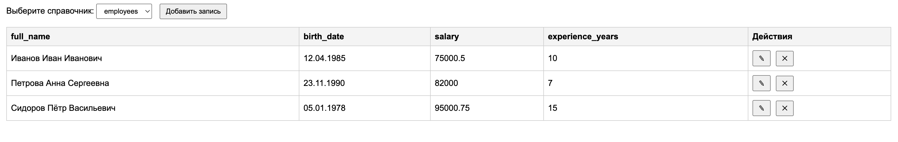

### Справочник Employees

| Поле               | Тип данных       | Описание                               |
|--------------------|------------------|----------------------------------------|
| `id`               | INTEGER (PK)     | Уникальный идентификатор                |
| `full_name`        | TEXT             | ФИО сотрудника                         |
| `birth_date`       | DATE             | Дата рождения                          |
| `salary`           | REAL             | Зарплата (число с фиксированной запятой) |
| `experience_years` | INTEGER          | Стаж (целое число лет)                 |

### Справочник Projects

| Поле               | Тип данных       | Описание                               |
|--------------------|------------------|----------------------------------------|
| `id`               | INTEGER (PK)     | Уникальный идентификатор                |
| `name`             | TEXT             | Название проекта                       |
| `description`      | TEXT             | Описание (многострочный текст)         |
| `start_date`       | DATE             | Дата начала проекта                    |
| `budget`           | REAL             | Бюджет (число с фиксированной запятой)  |
| `manager_id`       | INTEGER (FK)     | Руководитель → **Employees.id** (внешний ключ) |


## Установка и запуск

1. Установите Flask
В терминале в корневой папке проекта выполните:
```
pip install -r requirements.txt
```
(при необходимости используйте `pip3`)

2. Запустите сервер:
```
python app.py
```

После запуска появится строка:
```
Running on http://127.0.0.1:5000/ (Press CTRL+C to quit)
```

3. Откройте приложение в браузере по адресу:  
**http://127.0.0.1:5000**  
Не открывайте файл `index.html` напрямую — он должен работать через веб-сервер.

4. Чтобы остановить сервер, нажмите `Ctrl+C` в терминале.

## Внешний вид приложения

